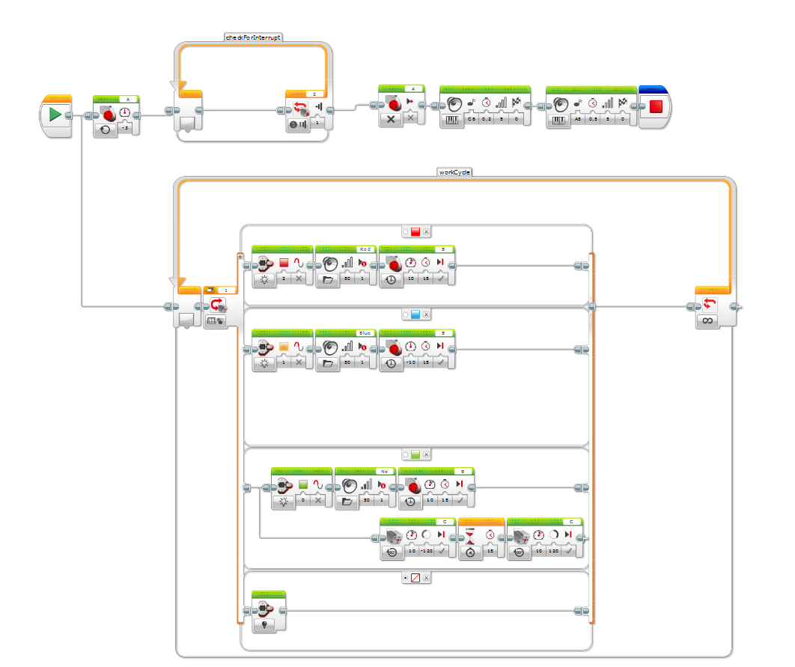
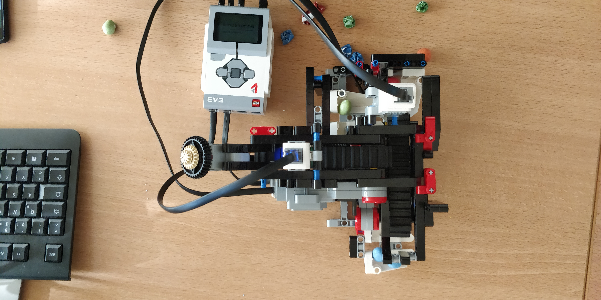
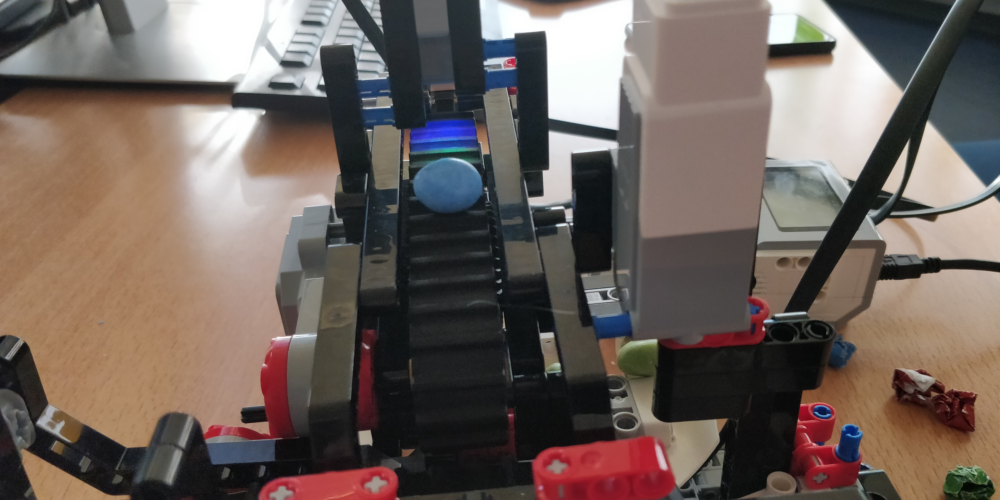

# Algorithmen und Programmieren 1

## Projekt 1 - Roboter

Ziel des Projektes war es, einen Lego Mindstorms Roboter zu bauen und (mit der dafür konzipierten Software) zu programmieren.
Unsere Gruppe - bestehend aus Sebastian und Nicos - hat sich die Aufgabe überlegt, Smarties bzw. Skittles nach Farbe zu sortieren.
Dabei sollte der Roboter zwischen drei Farben unterscheiden und diese dementsprechend in verschiedene Auffang-Behältnisse aufteilen.

### Funktionsweise

Das letzteindliche Flussdiagramm:

Ein Screenshot des Programms in der Software von Lego Mindstorms:

### Ergebnis

Unser Roboter unterscheidet zwischen rot, blau und grün, wobei er alle grünen Objekte "aussortiert".
Neben dem Sortierprozess gibt er gleichzeitig visuelles und akustisches Feedback.
Die Statusanzeige leuchtet in rot, grün und orange auf, da Blau hier leider keine Option ist.
Außerdem spricht er die Voicelines "Red" und "Blue" für die jeweiligen Farben, sowie "No!" für das Aussortieren von Grünem - denn wer mag schon grün?

