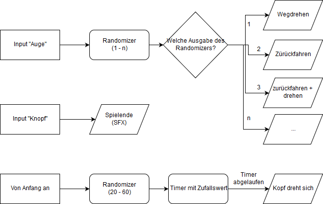
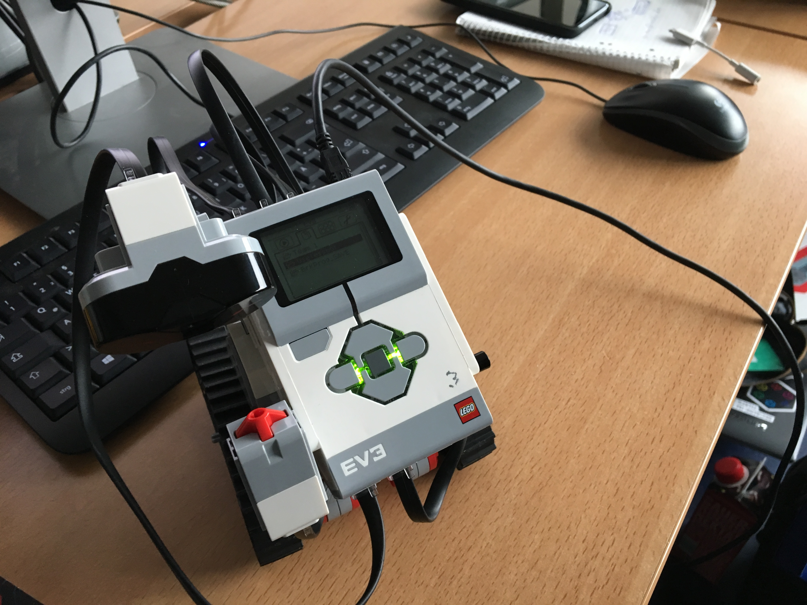

# Algorithmen und Programmieren 1

## Projekt 1 - Roboter

Funktion: Spiel

Ziel des Spiels: Den Knopf des Roboters drücken, während er nicht hinguckt.

Wenn die Hand des Spielers in den Sichtbereich des Infrarotsensors kommt, reagiert der Roboter, indem er sich wegdreht oder wegfährt.
Dies tut er mit zufallsgenerierten Winkelgrößen und Distanzen.

Schafft man es den Knopf zu drücken, spielt eine Siegesmelodie und das Programm schliesst sich.

Ab und zu (zufallsgenerierter wert von 20 bis 60 Sekunden) dreht der Roboter seinen Kopf und sieht sich um, dabei aber von seinem zu beschützendem Knopf weg.
Diesen Moment gilt es auszunutzen um den Knopf zu drücken, jedoch sollte man darauf Achten, dass der Roboter einen nicht bemerkt während man von der Seite kommt.

### Funktionsweise

Hier ein Flussdiagramm und ein Screenshot der Anwendung. 

### Ergebnis

Hier sind 2 Bilder des Roboters zu sehen.

