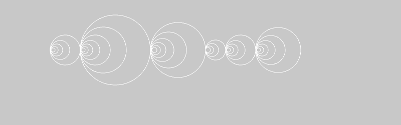

# Hausaufgabe
1) Funktionen, Pythagoras
* Entwickle die Funktion `float hypothenuse(float ankathete, float gegenkathete)`, die die Hypothenuse zweier Katheten eines rechtwickligen Dreiecks berechnet (Hinweis `sqrt()` berechnet die Quadratwurzel).
* Entwickle die Funktion `float kathete(float hypothenuse, float kathete)`, die die Kathete eines rechtwickligen Dreiecks berechnet. 
* Prüfe die Ergebnisse mithilfe von `cout`.

2) Arrays, Pythagoras
* Erstelle 2 Arrays mit je 10 Werten `float aKathete[]` und `float aHypothenuse[]` in denen Werte für die Kathetenberechnung speicherst. Berechne die jeweiligen Werte in einer Schleife und lasse sie per `cout` ausgeben.
* Was passiert wenn die Werte in der Funktion `float hypothenuse()` genutzt werden.

3) Arrays und Funktionen, Animation
Beende die letzte Aufgabe der vorherigen Lehrveranstaltung und animiere die Kreise.

